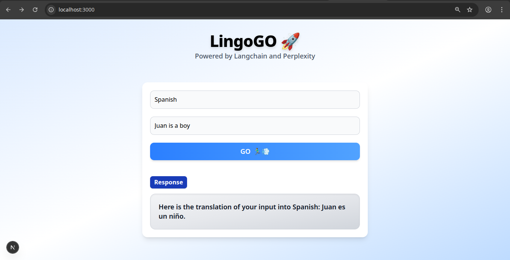

# V1

### Translator App - using chat models and prompt templates.

## Tech Stack

```
- Nextjs
- Langchain
- Perplexity API
```

### Goal - V1

- Simple prompt + configuration ✅
- Prompt template ✅
- User Input form ✅
- Refining LLM response ✅
- Response streaming(SSE) with UX ✅

--- 
### Goal - V2 (Q/A chatbot)

- UI with Chat with LLM, Chat with Doc, Chat with link modes.
- Documents and document loaders; ✅
- Text splitters; ✅
- Embeddings; ✅
- Vector stores and retrievers. ✅
- Integrate LLM with response streaming; 

#### Enchancements: 
- Check the vector db for doc hash before creating and adding embeddings for a doc.
- Delete the embeddings once the user disconnects or deletes through UI.

### SS 🖼️


